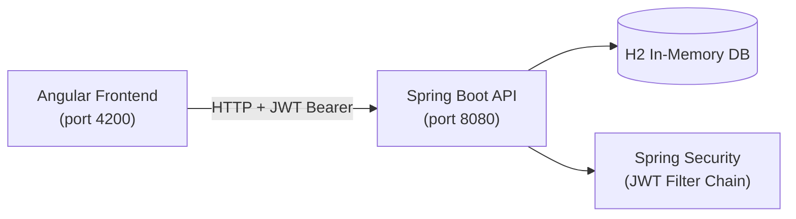
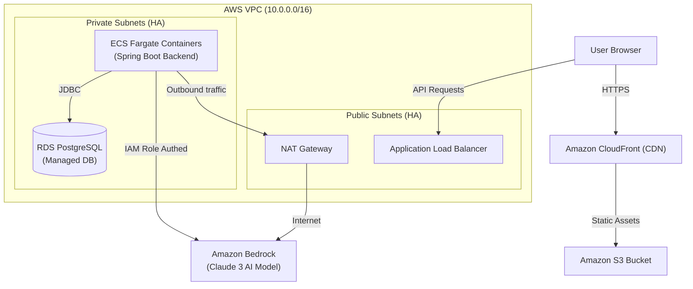
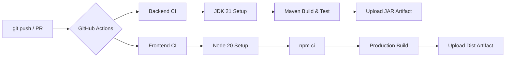

<div align="center">

# ⚡ Task Manager

### Full-Stack Task Management Application

[](https://github.com/RoccoDatena/Antigravity-Experiments/actions/workflows/backend-ci.yml)
[](https://github.com/RoccoDatena/Antigravity-Experiments/actions/workflows/frontend-ci.yml)

[](https://adoptium.net/)
[](https://spring.io/projects/spring-boot)
[](https://angular.io/)
[](LICENSE)

A modern, full-stack task management app with **JWT authentication**, **role-based access control**, **CI/CD pipelines**, and a **Glassmorphism** UI.

</div>

---

## ✨ Features

- 🔐 **JWT Authentication** — secure stateless login/signup
- 👥 **Role-Based Access** — Admin sees all tasks; Users see their own
- ✅ **Full CRUD** — create, edit, delete, quick-status tasks
- 🔍 **Live Filters** — filter by status, priority, and text search
- 📊 **Dashboard** — real-time stats with animated progress bars
- ⚠️ **Overdue Detection** — tasks past due date highlighted automatically
- 🛡️ **Admin Panel** — user management (Admin role only)
- 💎 **Glassmorphism UI** — dark gradient with frosted-glass cards

---

## 🏗️ Architecture


```
task-manager/            ← Angular 17 frontend (port 4200)
task-manager-backend/    ← Spring Boot 3 backend (port 8080)
```

### Local Architecture


### Production Target Architecture (AWS Cloud)
The infrastructure is defined as code in the `terraform/` directory.



---

## 🛠️ Tech Stack

| Layer | Technology |
|-------|-----------|
| Frontend | Angular 17, TypeScript, CSS (Glassmorphism) |
| Backend | Java 17+, Spring Boot 3.2, Spring Security |
| Database | H2 (in-memory, dev) |
| Auth | JWT (jjwt 0.11.5), BCrypt |
| Build | Maven (via wrapper), Angular CLI |

---

## 🚀 Getting Started

### Prerequisites

- **Java 17+** — [Download Temurin](https://adoptium.net/temurin/releases/?version=17)
- **Node.js 18+** — [Download](https://nodejs.org/)

> **No global Maven installation required** — the project includes a Maven Wrapper (`mvnw.cmd`) that downloads Maven automatically on first run.

---

### 1. Clone the repository

```bash
git clone https://github.com/RoccoDatena/Antigravity-Experiments.git
cd task-manager
```

### 2. Start the Backend

```powershell
cd task-manager-backend
cmd /c mvnw.cmd spring-boot:run   # Windows
# OR
./mvnw spring-boot:run            # Linux / macOS
```

On first run, the wrapper downloads Maven 3.9.6 (~10 MB). Wait for:
```
Started TaskManagerApplication in X seconds
=== DataSeeder: 3 users and 6 tasks created ===
```

**Backend URL:** `http://localhost:8080`  
**H2 Console:** `http://localhost:8080/h2-console` (JDBC URL: `jdbc:h2:mem:taskmanagerdb`)

### 3. Start the Frontend

```bash
cd task-manager
npm install
npm start
```

**App URL:** `http://localhost:4200`

---

## 🔑 Demo Credentials

| Username | Password | Role |
|----------|----------|------|
| `admin` | `password` | Admin — full access, user management |
| `user1` | `password` | User — sees own tasks only |
| `user2` | `password` | User — sees own tasks only |

> ⚠️ Change credentials and the JWT secret before any production deployment.

---

## 📡 API Endpoints

| Method | Endpoint | Auth | Description |
|--------|----------|------|-------------|
| `POST` | `/api/auth/login` | Public | Login → returns JWT |
| `POST` | `/api/auth/signup` | Public | Register new user |
| `GET` | `/api/tasks` | Any | List tasks (filterable) |
| `POST` | `/api/tasks` | Any | Create task |
| `PUT` | `/api/tasks/{id}` | Owner / Admin | Update task |
| `DELETE` | `/api/tasks/{id}` | Owner / Admin | Delete task |
| `GET` | `/api/tasks/stats` | Any | Dashboard statistics |
| `GET` | `/api/users` | Admin only | List all users |

### Filter Query Params (`GET /api/tasks`)

| Param | Values |
|-------|--------|
| `status` | `TODO`, `IN_PROGRESS`, `DONE` |
| `priority` | `LOW`, `MEDIUM`, `HIGH` |
| `search` | Free text (matches title & description) |

---

## 📁 Project Structure

```
task-manager-backend/
├── src/main/java/com/.../
│   ├── controller/       # AuthController, TaskController, UserController
│   ├── service/          # TaskService, UserService (business logic)
│   ├── model/            # User, Task (JPA entities)
│   ├── repository/       # JPA Repositories with custom JPQL queries
│   ├── security/         # WebSecurityConfig, JwtUtils, JwtAuthFilter
│   ├── dto/              # Request/Response DTOs
│   └── seeder/           # DataSeeder (dev data)
└── src/main/resources/
    └── application.properties

task-manager/
└── src/app/
    ├── pages/            # login, register, dashboard, tasks, users
    ├── components/       # navbar, task-modal
    ├── services/         # AuthService, TaskService, UserService
    ├── guards/           # AuthGuard
    └── interceptors/     # JwtInterceptor
```

---

## ⚙️ Configuration

Edit `task-manager-backend/src/main/resources/application.properties`:

```properties
# Change before production!
app.jwt.secret=your-super-secret-key-min-32-chars
app.jwt.expiration=86400000   # 24 hours in ms

# Swap H2 for a real database (e.g. PostgreSQL)
spring.datasource.url=jdbc:postgresql://localhost:5432/taskmanager
spring.datasource.driver-class-name=org.postgresql.Driver
spring.jpa.hibernate.ddl-auto=update
```

---

## ☁️ AWS Cloud & AI Integration

This project is architected with modern cloud-native patterns and AI integration, aligned with **AWS Certified Solutions Architect** and **AWS Certified AI Practitioner** standards.

### 🧠 Amazon Bedrock AI Suggestions
The backend includes an integration with **Amazon Bedrock** (`AwsBedrockService.java`) that leverages the **Anthropic Claude 3 Haiku** model.
- **Endpoint:** `GET /api/tasks/{id}/ai-suggest`
- **Behavior:** The AI analyzes the task's title and description to automatically generate 3 actionable subtasks as a structured JSON response.
- **Local Fallback:** If Bedrock is disabled, a local mock-up service returns standard suggestions, keeping the app fully functional offline.

To enable Bedrock locally:
1. Ensure you have AWS credentials configured (e.g., in `~/.aws/credentials`).
2. Add the following to `application.properties`:
   ```properties
   app.aws.bedrock.enabled=true
   app.aws.region=eu-west-1
   ```

### 🏗️ Infrastructure as Code (Terraform)
The `terraform/` directory defines a production-ready, highly available, secure deployment environment on AWS:
- **Security (VPC):** Public and Private subnets across multiple Availability Zones. ECS backend runs on private subnets, reachable only via the Application Load Balancer. Database (RDS PostgreSQL) is restricted to private subnets.
- **Serverless Compute (ECS Fargate):** Scalable Docker container orchestration without managing underlying EC2 hosts.
- **Global CDN (S3 + CloudFront):** Angular frontend static hosting on S3 with Origin Access Control (OAC), restricting access exclusively to CloudFront.
- **Least Privilege (IAM):** ECS task execution roles grant strict access to logging and ECR, with a dedicated policy allowing Bedrock model invocation (`bedrock:InvokeModel`).

---

## 🔄 DevOps & CI/CD

This project implements **Continuous Integration** using **GitHub Actions** with two independent pipelines that run automatically on every push and pull request.

### Pipeline Overview



### Backend CI (`backend-ci.yml`)

| Step | Description |
|------|-------------|
| **Checkout** | Clones the repository |
| **JDK 21 (Temurin)** | Sets up Java with Maven dependency caching |
| **Build & Verify** | Runs `./mvnw clean verify` (compile + tests) |
| **Upload Artifact** | Stores the built `.jar` for 7 days |

### Frontend CI (`frontend-ci.yml`)

| Step | Description |
|------|-------------|
| **Checkout** | Clones the repository |
| **Node.js 20** | Sets up Node with npm dependency caching |
| **Install** | Clean install via `npm ci` |
| **Build** | Production build with ahead-of-time compilation |
| **Upload Artifact** | Stores the `dist/` bundle for 7 days |

> 💡 Both pipelines run automatically on every push and pull request to `main`.

---

## 🤝 Contributing

1. Fork the repository
2. Create a feature branch: `git checkout -b feature/my-feature`
3. Commit your changes: `git commit -m "feat: add my feature"`
4. Push and open a Pull Request

---

## 📄 License

This project is licensed under the **MIT License** — see the [LICENSE](LICENSE) file for details.
